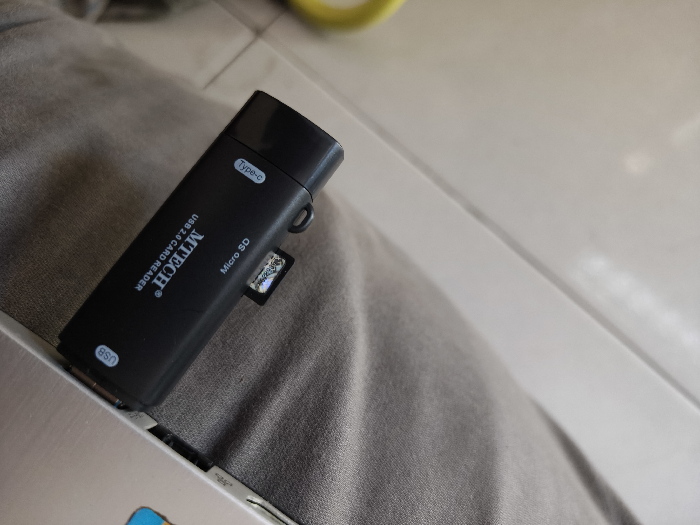

# Persiapan
stb b860h
memorycard minimal 6 gb
card redear
usb male to male

## shofware yang diperlukan 
- usb burning tools https://androidmtk.com/download-amlogic-usb-burning-tool
- boot card maker https://wiki.coreelec.org/coreelec:aml_burncard
- aerofalsher
atau silakan donwload link ini

# Step 1
- masukan sd card ke cardreader

- setlah itu masukan ke leptop pastikan sdcard terbaca
kalian dapat mengunakan carreder seperti di gamabar atau cardreder berupa usb

- jika terbaca maka akan muncul di file manager bagian this pc

- setelah itu masuk ke aplikasi bootcardmaker di step ini kita akan menformat sdcard kita agar bisa terbaca dan booting di stb yang kita punya 

- pilih sdcard kita dan centang to partion and format

- setalah itu pilih file yg tadi sudah di download di dalam file boot.bin dan pilih u-boot.bin

- jika sudah berhasil terformatmaka akan ada tulisan sucsesfuly
