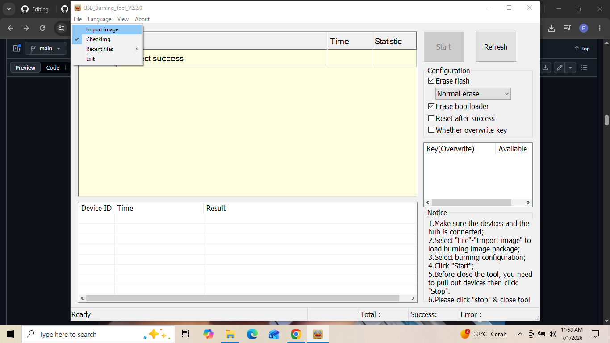
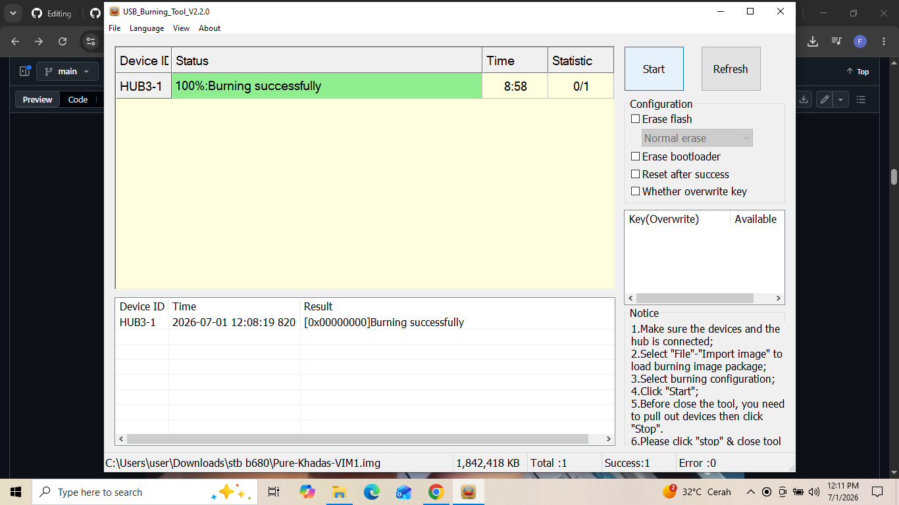
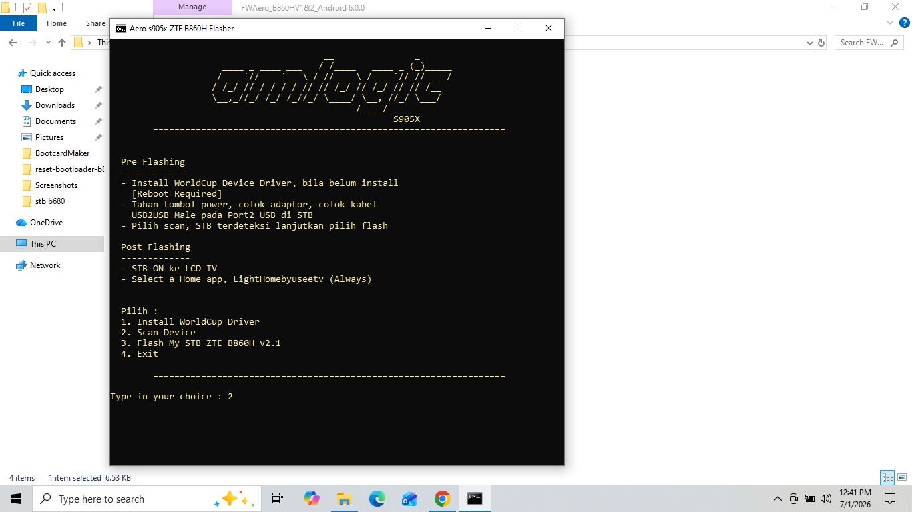

# Persiapan
stb b860h
memorycard minimal 6 gb
card redear
usb male to male

## shofware yang diperlukan 
- usb burning tools https://androidmtk.com/download-amlogic-usb-burning-tool
- boot card maker https://wiki.coreelec.org/coreelec:aml_burncard
- aerofalsher
- rufus
atau silakan donwload link ini
> catatan harap download semua file diatas

# Step 1
- masukan sd card ke cardreader

- setlah itu masukan ke leptop pastikan sdcard terbaca
kalian dapat mengunakan carreder seperti di gamabar atau cardreder berupa usb

- jika terbaca maka akan muncul di file manager bagian this pc

- setelah itu masuk ke aplikasi bootcardmaker di step ini kita akan menformat sdcard kita agar bisa terbaca dan booting di stb yang kita punya 

- pilih sdcard kita dan centang to partion and format

- setalah itu pilih file yg tadi sudah di download di dalam file boot.bin dan pilih u-boot.bin

- jika sudah berhasil terformatmaka akan ada tulisan sucsesfuly
- setelah itu pindahkan semua file yg ada di boot.bin ke sdcard yg tadi sudah di format

# step 2 mengcopy firmware
- cabut sdcard dari card reader dan masukan ke dalam slot sdcard stb
- setelah itu masukan sdcard ke stb kita
- lalu buka aplikasi usb burning tools
- colokan usb male tomale ke komputer dan stb

  
  > catatan penting kalian harus memasukan dan menyalakan usb male to male dan stb secara bersamaan

- setalah ada di tampilan aplikasu usb burning tools pilih sesuai gamabar yakitu import image lalu pilih file Pure-Khadas-VIM1 di step ini kita akan mengganti firmware dengan Pure-Khadas-VIM1

  

  - lalu unceklist semua yang ada di bagian kanan
  - setelah itu klik start dan tunggu hingga proses nya seratus persen
  - jika gagal maka ulag lagi step nya dari import images
  - kalau masuh gagal ulang dari colok usb male to male
  

  

  - setelah 100% sekarang kita berpindah utuk instal android nya di stb
  - buka file aoreflasher yg tadi sudah di download
  - lalu ketik 2

    
  
  
 - setelah itu cek pada bagian paling atas, apakah sudah ada device yang terscan

- kemudian jika sudah ada, klik spasi

- kemudian tunggu hingga selesai

- setelah selesai, ketik huruf e lalu enter untuk keluar dari terminal

# step 3

- setelah selesai mka step tadi kita sudah berhasil mengistal android di stb kita

- selanjut hubungkan set top box ke monitor atau tv untuk memastikan dengan benar apakah sudah terinstall android di stb 

- lalu kita tunggu hingga selesai booting setelah selesai

- hubungkan mouse ke set top box

- sambungkan wifi pada android os tv

- maka sudah berhasil menginstall android pada set top box

- lalu keluarkan microsd dari set top box

# step 4 di step ini kita akan mengistall linux arambian di stb

- langkah pertama yakni keluarkan sdcard dari stb
