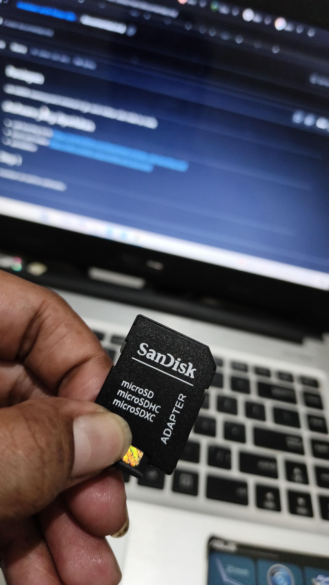

## Persiapan
stb b860h
memorycard minimal 6 gb
card redear
usb male to male

## shofware yang diperlukan 
- usb burning tools https://androidmtk.com/download-amlogic-usb-burning-tool
- boot card maker https://wiki.coreelec.org/coreelec:aml_burncard
- aerofalsher

## Step 1
masukan sd card ke cardreader

setlah itu masukan ke leptop pastikan sdcard terbaca
kalian dapat mengunakan carreder seperti di gamabar atau cardreder berupa usb

jika terbaca maka akan muncul di file manager bagian this pc
